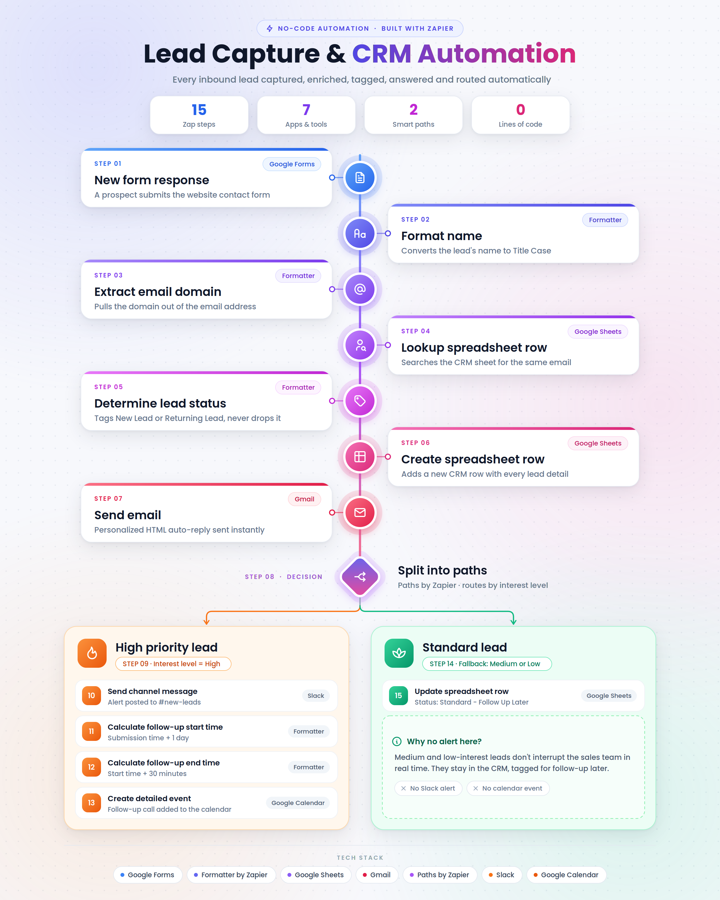
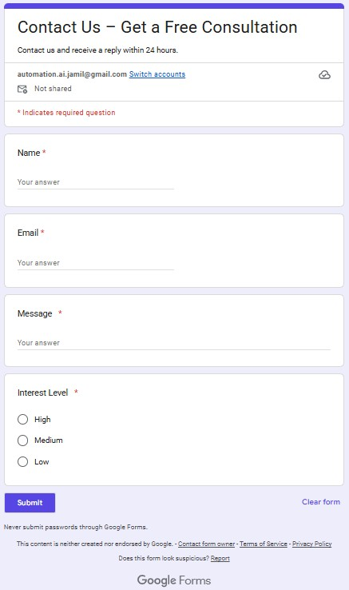
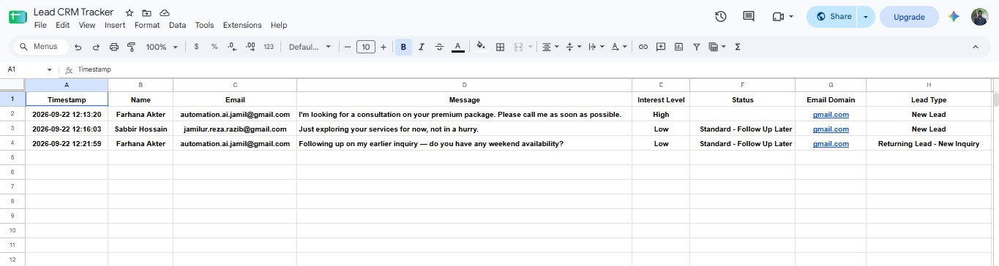
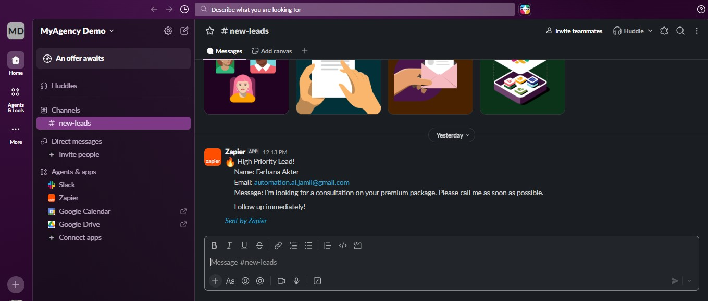
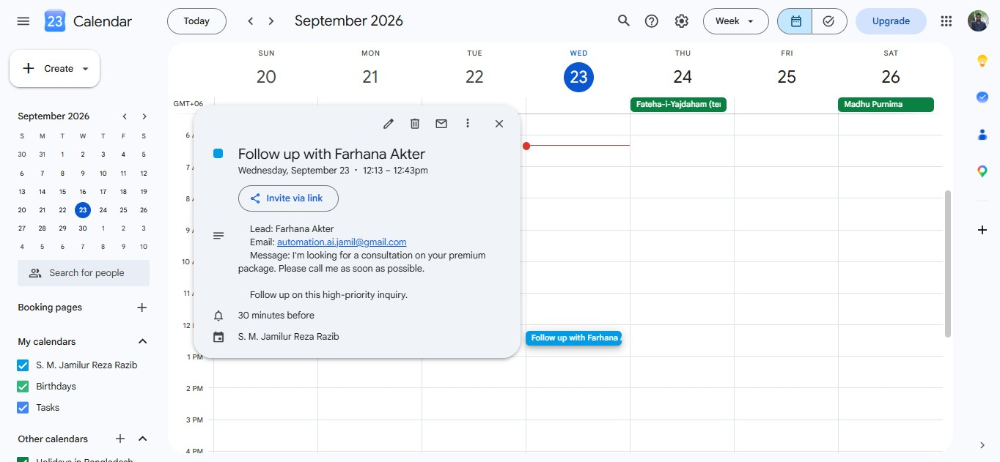
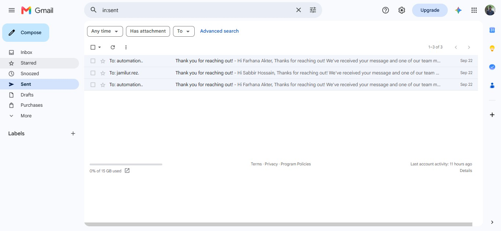
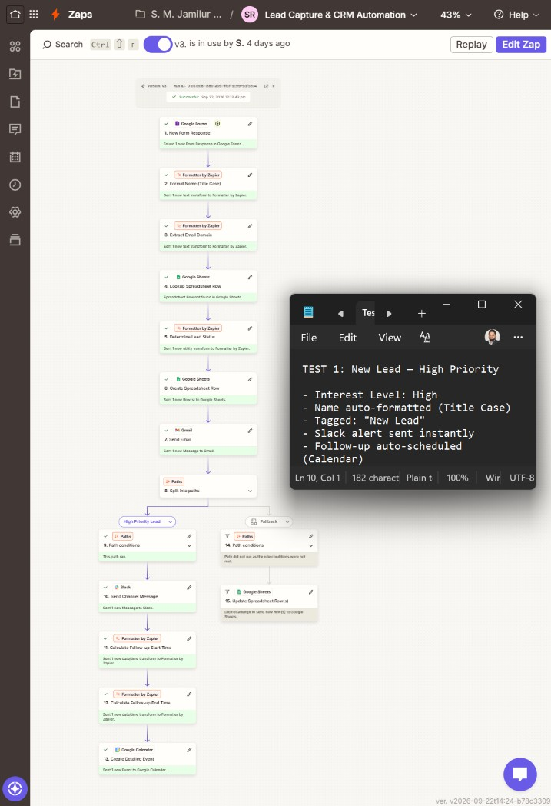
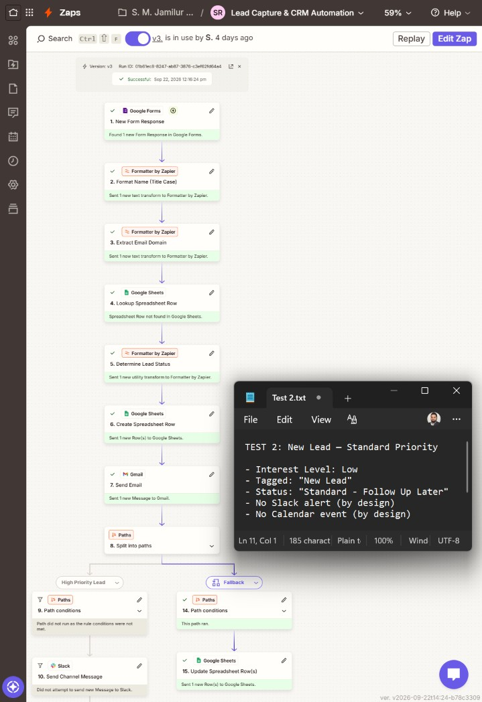
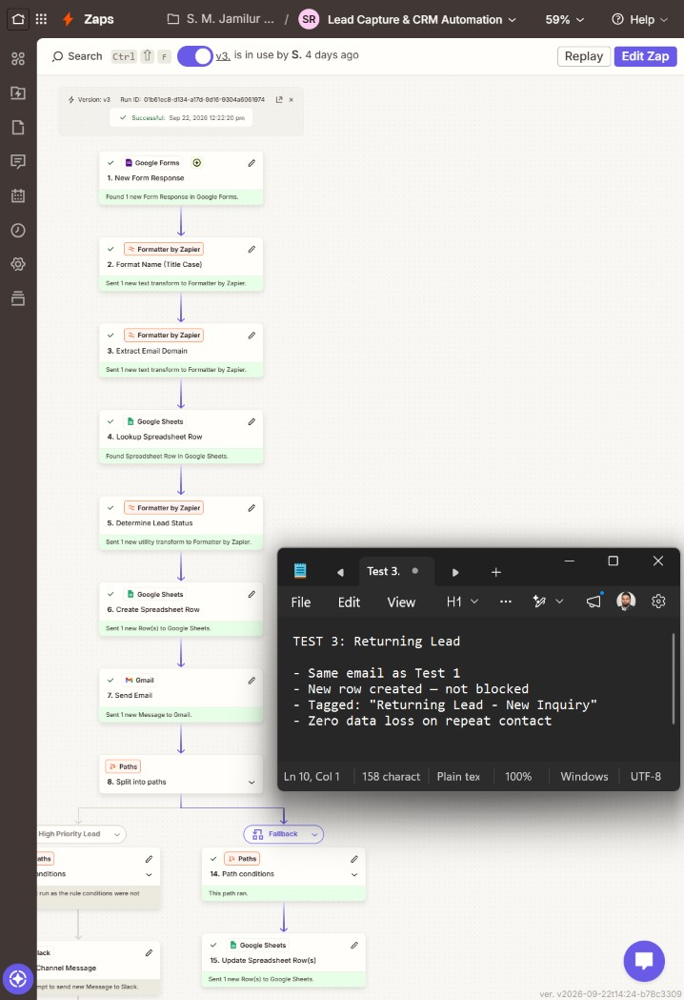
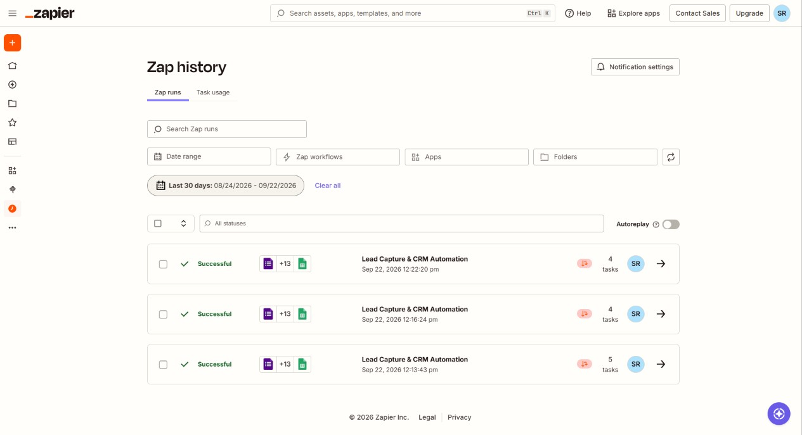

# Lead Capture & CRM Automation with Zapier

A hands-on, no-code lead triage and CRM automation built with **Zapier**, **Google Forms**, **Formatter by Zapier**, **Google Sheets**, **Gmail**, **Paths by Zapier**, **Slack**, and **Google Calendar**.

The workflow captures inbound inquiries, cleans and enriches lead data, identifies new vs. returning leads, logs every inquiry in a lightweight Google Sheets CRM, sends an instant personalized email reply, and routes leads by interest level.

- **High-priority lead:** sends a real-time Slack alert and automatically schedules a 30-minute follow-up call for the next day.
- **Standard lead:** updates the CRM for later follow-up without sending a Slack alert or creating a Calendar event.
- **Returning lead:** logs the new inquiry as a separate CRM row and tags it as `Returning Lead - New Inquiry` instead of blocking it.

## Architecture



The supplied architecture reflects the final 15-step Zap: **7 apps/tools**, **2 routing paths**, and **0 lines of code**.

For the step-by-step workflow explanation, see [`docs/ARCHITECTURE.md`](docs/ARCHITECTURE.md).

## Project links

- 🎬 **Demo video:** [Watch the Zap execution on Google Drive](https://drive.google.com/file/d/133A10YTAreheAeu60z94P0cTMDxQwMAX/view?usp=sharing)
- 📁 **Project files:** [Open the project folder on Google Drive](https://drive.google.com/drive/folders/1KtXHcJAb0gCPPm0Btfm2z3-B4FOCQgNX?usp=sharing)
- 📝 **Google Form:** [Contact Us - Get a Free Consultation](https://forms.gle/HTtURQiUVMTkEo6s9)
- 📊 **Google Sheet:** [Lead CRM Tracker](https://docs.google.com/spreadsheets/d/1dit2elTp-Wyv-KVT-Dlj6A658Iqn8fXuqhduQxuc1K4/edit?gid=1534879702#gid=1534879702)

> Access to the live Google resources depends on their current sharing permissions. The demo video is hosted externally to keep the GitHub repository focused on documentation, screenshots, and the sanitized Zap export.

## What the workflow does

1. **Google Forms** receives a new lead submission.
2. **Formatter by Zapier** converts the lead name to Title Case.
3. **Formatter by Zapier** extracts the email domain.
4. **Google Sheets** checks whether the same email already exists in the CRM.
5. A **Formatter lookup table** tags the inquiry as `New Lead` or `Returning Lead - New Inquiry`.
6. **Google Sheets** creates a new CRM row for every inquiry.
7. **Gmail** sends a personalized HTML auto-reply.
8. **Paths by Zapier** routes the lead based on interest level.
9. **High Priority Lead** runs only when `Interest Level = High`.
10. **Slack** sends a real-time alert to the sales channel.
11. **Formatter** calculates the follow-up start time as submission time + 1 day.
12. **Formatter** calculates the end time as start time + 30 minutes.
13. **Google Calendar** creates the follow-up event.
14. **Fallback** handles Medium / Low interest leads.
15. **Google Sheets** updates the CRM status to `Standard - Follow Up Later`.

## Zap workflow overview


## Lead triage logic

### High Priority Lead

When the submitted **Interest Level** exactly matches `High`:

- the lead is already saved in the CRM
- the auto-reply is already sent
- Slack receives a high-priority lead alert
- the workflow calculates a follow-up time for the next day
- Google Calendar creates a 30-minute follow-up event

### Fallback / Standard Lead

When the High Priority condition does not match:

- no Slack alert is sent
- no Calendar event is created
- the CRM row is updated with `Standard - Follow Up Later`

This fallback path covers the current **Medium** and **Low** options in the Google Form.

## New vs. returning lead detection

The workflow searches the CRM by email before creating the new row.

- Search result found → `Returning Lead - New Inquiry`
- No previous row found → `New Lead`

A returning lead is **not blocked**. The new inquiry is still written as a separate row so repeat contacts are preserved.

## CRM data model

The Zap writes to a dedicated `CRM` worksheet with these fields:

| Column | Field | Source / behavior |
|---|---|---|
| A | Timestamp | Google Forms submission time |
| B | Name | Title Case formatter output |
| C | Email | Original form email |
| D | Message | Original form message |
| E | Interest Level | High / Medium / Low |
| F | Status | Fallback path writes `Standard - Follow Up Later` |
| G | Email Domain | Extracted from the email address |
| H | Lead Type | `New Lead` or `Returning Lead - New Inquiry` |

The Google Forms-linked `Form Responses 1` worksheet remains the raw response log, while the Zap manages the separate `CRM` worksheet.

## Tech stack

- **Zapier** — no-code workflow orchestration
- **Google Forms** — lead intake
- **Formatter by Zapier** — Title Case, email-domain extraction, lookup table, date/time calculations
- **Google Sheets** — lightweight CRM, lead lookup, row creation, status updates
- **Gmail** — personalized auto-reply
- **Paths by Zapier** — high-priority vs. fallback routing
- **Slack** — real-time high-priority sales alert
- **Google Calendar** — automatic follow-up call scheduling

The project was built using a **Zapier Professional 14-day trial** because multi-step Zaps and Paths require the relevant Zapier plan features.

## Project evidence

### Google Form



### CRM in Google Sheets



### High-priority Slack alert



### Follow-up Calendar event



### Auto-reply email



## Testing

Three end-to-end tests were documented through the published Google Form and verified using Zap History plus the connected destination apps.

| Test | Scenario | Expected routing | Result |
|---|---|---|---|
| Test 1 | New lead, High interest | High Priority path | ✅ Pass |
| Test 2 | New lead, Low interest | Fallback path | ✅ Pass |
| Test 3 | Returning lead, Low interest | Returning lead + Fallback path | ✅ Pass |

**Summary: 3/3 documented tests passed.**

### Test 1 - New Lead / High Priority

Verified outcomes:

- name normalized to Title Case
- lead tagged as `New Lead`
- CRM row created
- auto-reply sent
- Slack alert sent
- 30-minute follow-up Calendar event scheduled for the next day



### Test 2 - New Lead / Standard Priority

Verified outcomes:

- lead tagged as `New Lead`
- CRM row created
- status updated to `Standard - Follow Up Later`
- auto-reply sent
- no Slack alert
- no Calendar event



### Test 3 - Returning Lead

Verified outcomes:

- existing email found by the lookup step
- new inquiry created as a new CRM row
- lead tagged as `Returning Lead - New Inquiry`
- Fallback path executed for Low interest
- auto-reply sent
- the repeat inquiry was not discarded



### Zap History

The supplied Zap History screenshot shows all three documented test runs as successful.



More details: [`docs/TEST_RESULTS.md`](docs/TEST_RESULTS.md).

## Key design decisions

- **Separate CRM worksheet:** avoids duplicate rows caused by Google Forms already writing to its own response sheet.
- **Returning leads are tagged, not blocked:** preserves repeat inquiries instead of dropping them.
- **Lead Type and Status are separate fields:** prevents a follow-up status update from overwriting new/returning lead classification.
- **Only High interest creates real-time interruptions:** Slack and Calendar are reserved for the highest-priority path.
- **Dynamic follow-up timing:** every High-priority lead gets a follow-up based on its own submission time instead of a fixed date.
- **Data is cleaned before downstream actions:** the normalized name is reused in the CRM, email, Slack message, and Calendar event.

## Repository structure

```text
lead-capture-crm-automation-zapier/
├── README.md
├── docs/
│   ├── ARCHITECTURE.md
│   ├── DEMO.md
│   ├── IMPLEMENTATION_NOTES.md
│   ├── SETUP.md
│   ├── TEST_RESULTS.md
│   └── architecture-diagram.png
├── screenshots/
│   ├── email-auto-reply.jpg
│   ├── google-calendar-follow-up-event.jpg
│   ├── google-form.jpg
│   ├── google-sheet-crm.jpg
│   ├── slack-high-priority-alert.jpg
│   ├── test-1-high-priority-lead.jpg
│   ├── test-2-standard-priority-lead.jpg
│   ├── test-3-returning-lead.jpg
│   ├── zap-history-all-tests.jpg
│   └── zap-workflow-overview.png
└── workflows/
    └── lead-capture-crm-automation.sanitized.json
```

## Setup

See [`docs/SETUP.md`](docs/SETUP.md) for the rebuild checklist, app connections, CRM fields, routing logic, and public-export placeholders.

## Demo and resources

See [`docs/DEMO.md`](docs/DEMO.md) for the supplied external project resources in one place.

## Public Zap export sanitization

The workflow JSON in this repository is a **sanitized Zapier export**. Account-specific values are removed or replaced before public sharing, including:

- Zapier account / user IDs
- connected-app authentication IDs
- Google Form identifier
- Google Spreadsheet identifier
- Slack channel identifier
- personal sender / test email values inside the export

The supplied live resource links are documented separately from the sanitized workflow JSON.

## Current implementation limitations

- Returning leads are matched by **email only**.
- A returning person who uses a different email is treated as a new lead.
- The follow-up is always calculated as **submission time + 1 day**, so it can fall outside business hours.
- Interest level is self-reported in the form.
- The current High Priority rule checks only `Interest Level = High`.
- Medium and Low are handled by the same Fallback path.
- Multi-step Zaps and Paths depend on Zapier plan availability.

## Possible enhancements

- business-hours-aware follow-up scheduling
- weekly digest for Standard leads
- richer lead scoring using interest level plus email-domain signals
- CRM dashboard / reporting layer
- AI-assisted inquiry summarization or reply drafting

## Learning outcomes demonstrated

This project demonstrates hands-on work with:

- Zapier multi-step workflow design
- Google Forms lead capture
- Formatter by Zapier data transformation
- Google Sheets CRM automation
- new vs. returning lead detection
- Paths by Zapier conditional routing
- Gmail auto-reply automation
- Slack sales alerts
- Google Calendar event creation
- dynamic date/time calculations
- end-to-end workflow testing
- sanitizing automation exports for public GitHub sharing
